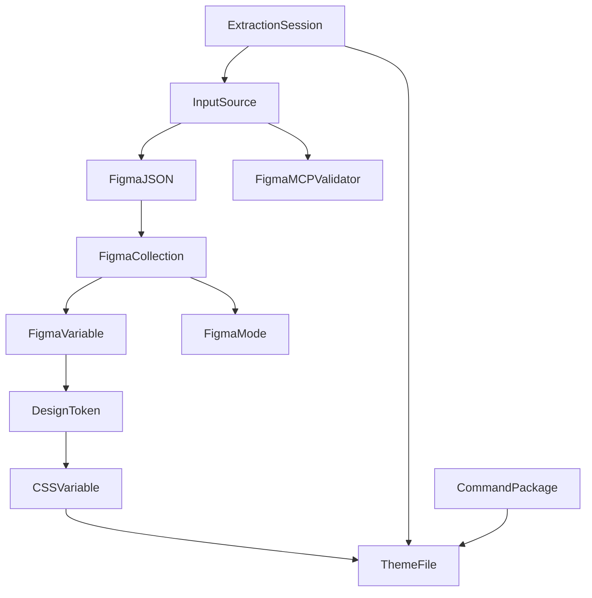

# Data Model: Figma Design Tokens to Tailwind 4 Theme Extraction

**Date**: 2025-11-06
**Feature**: 001-figma-theme-extraction
**Phase**: 1 - Design

## Overview

This document defines the entities, data structures, and relationships for the Figma to Tailwind 4 theme extraction tool. The data flow follows this pipeline:

```
Input Source → Figma JSON → Extracted Tokens → Transformed CSS Variables → Theme File
```

---

## Core Entities

### 1. InputSource

Represents the origin of design system data.

**Properties:**
- `type`: `'url' | 'file'` - Source type
- `value`: `string` - URL string or file path
- `priority`: `'file' | 'url'` - Which source to use if both provided
- `validationStatus`: `'pending' | 'valid' | 'invalid'` - Validation state
- `error`?: `string` - Error message if validation fails

**Validation Rules:**
- At least one of `url` or `file` must be provided
- If both provided, `file` takes priority
- URL must match Figma URL pattern
- File must exist and be readable

**State Transitions:**
```
pending → (validate) → valid | invalid
```

---

### 2. FigmaMCPValidator

Component that checks MCP functionality when URL input is used.

**Properties:**
- `isAvailable`: `boolean` - MCP tool is installed
- `isFunctional`: `boolean` - MCP tool responds correctly
- `validationStatus`: `'pending' | 'pass' | 'fail'` - Validation result
- `errorMessage`?: `string` - Error description if validation fails
- `helpMessage`?: `string` - Troubleshooting instructions

**Methods:**
- `validate()`: Performs test MCP operation (whoami)
- `getHelpText()`: Returns user-friendly error message with fix instructions

**Validation Logic:**
```typescript
async function validate(): Promise<ValidationResult> {
  try {
    const response = await mcp.figma.whoami();
    return response?.user ? { status: 'pass' } : { status: 'fail', error: 'Invalid response' };
  } catch (error) {
    return { status: 'fail', error: error.message, help: getHelpText() };
  }
}
```

---

### 3. FigmaJSON

The intermediate JSON structure containing all extracted tokens from Figma.

**Properties:**
- `schemaVersion`: `number` - Figma JSON schema version (currently 1)
- `lastModified`: `string` - ISO 8601 timestamp
- `collections`: `FigmaCollection[]` - Array of variable collections
- `sourceType`: `'url' | 'file'` - Origin of the data
- `extractedAt`: `string` - ISO timestamp of extraction

**Structure Reference:**
```typescript
interface FigmaJSON {
  schemaVersion: number;
  lastModified: string;
  collections: FigmaCollection[];
}
```

**Validation Rules:**
- Must have `schemaVersion` field (currently only version 1 supported)
- Must have `collections` array (can be empty)
- Schema version mismatch results in warning but continues processing

---

### 4. FigmaCollection

A group of related variables in Figma (e.g., "Colors", "Themes", "Spacing").

**Properties:**
- `id`: `string` - Unique collection ID (format: `VariableCollectionId:fileId:nodeId`)
- `name`: `string` - Human-readable collection name
- `key`: `string` - SHA1 hash for stable identity
- `defaultModeId`: `string` - Which mode is default
- `modes`: `FigmaMode[]` - Available modes (Light, Dark, etc.)
- `variables`: `FigmaVariable[]` - Variables in this collection
- `hiddenFromPublishing`: `boolean` - Visibility flag
- `remote`: `boolean` - Whether variables are from linked library

**Relationships:**
- Has many `FigmaVariable` (1:N)
- Has many `FigmaMode` (1:N)

---

### 5. FigmaMode

A variation of a design system (e.g., Light theme, Dark theme).

**Properties:**
- `name`: `string` - Mode name (e.g., "Light", "Dark")
- `modeId`: `string` - Unique mode identifier within collection

**Phase 1 Scope:**
- Extract first mode only (typically Light mode or default mode)
- Multi-mode support is out of scope (see spec.md line 327)

---

### 6. FigmaVariable

A single design token from Figma.

**Properties:**
- `id`: `string` - Unique variable ID (format: `VariableID:fileId:nodeId`)
- `name`: `string` - Hierarchical name (e.g., "Primary/Midnight Indigo/100")
- `description`: `string` - Optional description
- `key`: `string` - SHA1 hash for stable identity
- `resolvedType`: `'COLOR' | 'FLOAT' | 'STRING'` - Value type
- `valuesByMode`: `Record<string, FigmaValue>` - Values for each mode
- `scopes`: `string[]` - Where variable can be applied (e.g., `["ALL_SCOPES"]`)
- `variableCollectionId`: `string` - Parent collection ID

**Type-specific properties:**

#### COLOR Variables:
```typescript
type ColorValue =
  | { r: number; g: number; b: number; a: number } // Direct RGB (0-1 range)
  | { type: 'VARIABLE_ALIAS'; id: string }         // Reference to another variable
```

#### FLOAT Variables:
```typescript
type FloatValue = number; // Spacing (px), border radius (px), font size (px)
```

#### STRING Variables:
```typescript
type StringValue = string; // Font family names, etc.
```

**Relationships:**
- Belongs to `FigmaCollection` (N:1)
- May reference another `FigmaVariable` via alias (N:1 self-reference)

---

### 7. DesignToken

Extracted and normalized design token (intermediate representation).

**Properties:**
- `id`: `string` - Original Figma variable ID
- `category`: `TokenCategory` - Token classification
- `name`: `string` - Original hierarchical name
- `namePath`: `string[]` - Name split by hierarchy (e.g., `["Primary", "500"]`)
- `value`: `TokenValue` - Resolved primitive value
- `metadata`: `TokenMetadata` - Additional information

**TokenCategory Enum:**
```typescript
enum TokenCategory {
  Color = 'color',
  FontFamily = 'font',
  FontSize = 'text',
  FontWeight = 'font-weight',
  LineHeight = 'leading',
  LetterSpacing = 'tracking',
  Spacing = 'spacing',
  BorderRadius = 'radius',
  Shadow = 'shadow'
}
```

**TokenValue Types:**
```typescript
type TokenValue =
  | { type: 'color'; r: number; g: number; b: number; a: number }
  | { type: 'float'; value: number; unit?: string }
  | { type: 'string'; value: string }
  | { type: 'shadow'; layers: ShadowLayer[] }
```

**TokenMetadata:**
```typescript
interface TokenMetadata {
  source: 'figma';
  collectionName: string;
  mode: string;
  description?: string;
  scopes: string[];
}
```

**Extraction Rules:**
- Resolve all `VARIABLE_ALIAS` references to primitive values
- Categorize based on `resolvedType` and naming patterns
- Extract first mode only in Phase 1

---

### 8. CSSVariable

Transformed design token in Tailwind 4 CSS format.

**Properties:**
- `name`: `string` - CSS variable name (e.g., `--color-primary-500`)
- `value`: `string` - Transformed CSS value (e.g., `oklch(0.5 0.2 180)`)
- `category`: `TokenCategory` - Token category
- `sourceTokenId`: `string` - Reference to originating DesignToken
- `originalName`: `string` - Original Figma name for traceability

**Transformation Rules by Category:**

| Category | Input | Output | Transformation |
|----------|-------|--------|----------------|
| color | RGB (0-1) | OKLCH | `figmaRgbToOKLCH()`, gamut mapping |
| text | FLOAT (px) | rem | Divide by 16 |
| spacing | FLOAT (px) | rem | Divide by 16 |
| radius | FLOAT (px) | px or % | Preserve units |
| leading | FLOAT | dimensionless | Ratio relative to font size |
| font | STRING | string | Wrap in quotes if contains spaces |
| shadow | Shadow object | box-shadow | Format as CSS shadow syntax |

**Naming Convention:**
```typescript
function generateCSSVariableName(token: DesignToken): string {
  const prefix = `--${token.category}`;
  const sanitizedName = sanitizeTokenName(token.name);
  return `${prefix}-${sanitizedName}`;
}

// Examples:
// "Primary/500" + category:color → "--color-primary-500"
// "Space 04" + category:spacing → "--spacing-space-04"
// "Satoshi Variable" + category:font → "--font-satoshi-variable"
```

**Validation Rules:**
- Name must be unique (append `-2`, `-3` if duplicates detected)
- Name must be valid CSS identifier (alphanumeric, hyphens, underscores only)
- Value must be valid CSS value for the property type

---

### 9. ThemeFile

The generated `figma-theme-variables.css` output file.

**Properties:**
- `path`: `string` - Output file path (default: `./figma-theme-variables.css`)
- `content`: `string` - Generated CSS content
- `variables`: `CSSVariable[]` - All CSS variables included
- `totalTokenCount`: `number` - Total number of tokens
- `tokensByCategory`: `Record<TokenCategory, number>` - Token count per category
- `generationTimestamp`: `string` - ISO timestamp when file was generated
- `validationStatus`: `'pending' | 'valid' | 'invalid'` - CSS validity check

**Structure:**
```css
@theme {
  /* Colors */
  --color-primary-100: oklch(0.99 0 0);
  --color-primary-500: oklch(0.84 0.18 117.33);

  /* Typography */
  --font-display: "Satoshi", "sans-serif";
  --text-sm: 0.875rem;

  /* Spacing */
  --spacing-4: 1rem;

  /* Border Radius */
  --radius-md: 0.5rem;

  /* Shadows */
  --shadow-sm: 0 1px 2px oklch(0 0 0 / 0.05);
}
```

**Generation Rules:**
- Variables organized by category with comment headers
- Deterministic ordering (sorted alphabetically within each category)
- Consistent formatting (2-space indentation, one variable per line)
- Newline between category sections

**Validation:**
- Parse with CSS parser to ensure valid syntax
- Verify all CSSVariable objects are included
- Check for no duplicate variable names in output

---

### 10. ExtractionSession

Represents a single execution of the `t0t.extract-figma-theme` command.

**Properties:**
- `sessionId`: `string` - Unique session identifier (UUID)
- `timestamp`: `string` - ISO timestamp when command started
- `inputSource`: `InputSource` - Which input was used
- `mcpValidation`?: `FigmaMCPValidator` - MCP validation result (if URL used)
- `extractionResult`: `'success' | 'failure'` - Overall extraction outcome
- `transformationResult`: `'success' | 'failure'` - Overall transformation outcome
- `outputFilePath`?: `string` - Path to generated CSS file
- `totalTokensProcessed`: `number` - Number of tokens extracted
- `warnings`: `SessionWarning[]` - Non-fatal issues encountered
- `errors`: `SessionError[]` - Fatal errors that stopped execution
- `duration`: `number` - Execution time in milliseconds

**SessionWarning:**
```typescript
interface SessionWarning {
  code: string; // e.g., 'DUPLICATE_NAME', 'OUT_OF_GAMUT', 'UNSUPPORTED_TOKEN_TYPE'
  message: string;
  tokenId?: string;
  tokenName?: string;
}
```

**SessionError:**
```typescript
interface SessionError {
  code: string; // e.g., 'MCP_UNAVAILABLE', 'INVALID_JSON', 'FILE_NOT_FOUND'
  message: string;
  helpText?: string; // Troubleshooting instructions
  fatal: boolean; // Whether execution can continue
}
```

**Logging:**
- Log session start with input details
- Log progress for long-running operations (large files)
- Log warnings as they occur
- Log final summary with token counts by category

---

### 11. CommandPackage

The distributable package for the command.

**Properties:**
- `commandFilePath`: `string` - Path to command file (`.claude/commands/t0t.extract-figma-theme.md`)
- `utilitiesFolderPath`: `string` - Path to utilities folder (`.t0t-figma/`)
- `version`: `string` - Semantic version number (e.g., "1.0.0")
- `dependencies`: `PackageDependency[]` - Required npm packages
- `files`: `PackageFile[]` - All files in the package

**PackageDependency:**
```typescript
interface PackageDependency {
  name: string;
  version: string;
  required: boolean;
  purpose: string;
}

// Example:
{
  name: 'culori',
  version: '^4.0.0',
  required: true,
  purpose: 'Color conversion (RGB/HSL/HEX to OKLCH)'
}
```

**PackageFile:**
```typescript
interface PackageFile {
  relativePath: string;
  type: 'command' | 'script' | 'lib' | 'doc';
  purpose: string;
}
```

**Folder Structure:**
```
.claude/commands/
└── t0t.extract-figma-theme.md

.t0t-figma/
├── scripts/
│   ├── extract.ts
│   ├── transform.ts
│   ├── generate.ts
│   ├── color-converter.ts
│   ├── name-sanitizer.ts
│   ├── unit-converter.ts
│   └── validate-mcp.ts
├── lib/
│   └── (compiled JavaScript bundles)
└── templates/
    └── README.md
```

---

## Entity Relationships



---

## Data Flow Pipeline

### Stage 1: Input Validation

```
User Input → InputSource → Validation
  ↓
  ├─ If URL → FigmaMCPValidator → Pass/Fail
  └─ If File → File existence check → Pass/Fail
```

### Stage 2: Extraction

```
InputSource → Figma JSON → Collections → Variables → DesignTokens
```

**Alias Resolution:**
```
FigmaVariable (VARIABLE_ALIAS) → Resolve ID → Find target FigmaVariable → Repeat until primitive value
```

### Stage 3: Transformation

```
DesignToken → Apply category-specific transformation → CSSVariable
  ↓
  ├─ Color → OKLCH conversion + gamut mapping
  ├─ Float (spacing/text) → px to rem conversion
  ├─ Float (radius) → preserve units
  ├─ String (font) → quote if contains spaces
  └─ Shadow → CSS box-shadow syntax
```

### Stage 4: Generation

```
CSSVariable[] → Group by category → Sort alphabetically → Format CSS → ThemeFile
```

### Stage 5: Output

```
ThemeFile → Write to disk → Validate CSS syntax → Log summary
```

---

## State Machines

### InputSource Validation State Machine

```
[pending] → validate()
  ↓
  ├─ URL provided → check MCP → [valid] | [invalid]
  ├─ File provided → check existence → [valid] | [invalid]
  └─ Both provided → prioritize file → [valid] | [invalid]
```

### ExtractionSession State Machine

```
[started] → input validation
  ↓
[validating] → extraction
  ↓
[extracting] → transformation
  ↓
[transforming] → generation
  ↓
[generating] → output
  ↓
[completed] or [failed]
```

---

## Validation Rules Summary

### FigmaJSON Validation
- ✅ Must have `schemaVersion` field
- ✅ Must have `collections` array (can be empty)
- ⚠️ Schema version mismatch logs warning but continues

### FigmaVariable Validation
- ✅ Must have valid `resolvedType` (COLOR, FLOAT, STRING)
- ✅ Must have `valuesByMode` with at least one mode
- ✅ Alias references must resolve to primitive values (max depth: 10 to prevent infinite loops)

### DesignToken Validation
- ✅ Must have valid category
- ✅ Must have resolvable value (no unresolved aliases)
- ✅ Name must not be empty

### CSSVariable Validation
- ✅ Name must be unique
- ✅ Name must be valid CSS identifier
- ✅ Value must be valid CSS for the property type
- ✅ Color values must be in OKLCH format

### ThemeFile Validation
- ✅ Must be valid CSS (parseable by CSS parser)
- ✅ Must contain `@theme {}` wrapper
- ✅ All CSSVariable objects must be included
- ✅ No duplicate variable names

---

## Error Handling

### Non-Fatal Warnings (Log but Continue)
- Duplicate token names (auto-rename with suffix)
- Out-of-gamut colors (apply gamut mapping)
- Unsupported token types (skip with warning)
- Missing descriptions (proceed without)
- Empty collections (log warning, continue)

### Fatal Errors (Stop Execution)
- MCP unavailable when URL input used
- File not found when file input used
- Invalid JSON format
- Schema version not supported
- Unresolvable alias references (circular or missing)
- File write permission denied
- CSS generation fails validation

---

## Performance Considerations

### Memory Optimization
- Use stream-based JSON parsing for large files
- Process tokens in batches (avoid loading all in memory)
- Release intermediate objects after transformation

### Speed Optimization
- Parallel processing where possible (independent token transformations)
- Cache resolved aliases to avoid redundant lookups
- Pre-compile regex patterns for name sanitization

### Scalability
- Design for 50-500 tokens (primary use case)
- Support up to 10,000 tokens with streaming
- No hard limits on file size (streaming handles arbitrary sizes)

---

## Conclusion

This data model provides a complete specification of entities, relationships, validation rules, and data flow for the Figma to Tailwind 4 theme extraction tool. All entities support the deterministic output requirement from Constitution Principle I.

**Next Steps:**
- Generate API contracts (command interface, utility function signatures)
- Generate quickstart.md (developer setup guide)
